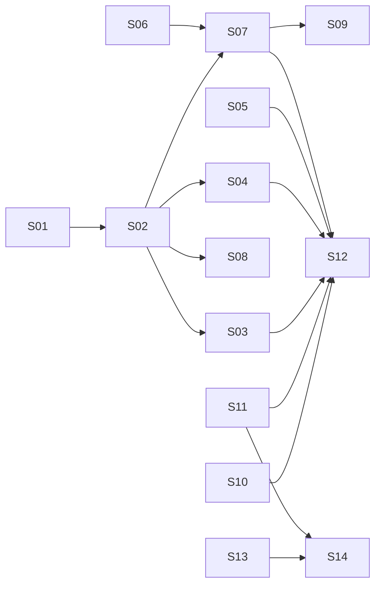

# P365-786 · Expired-plan renewal app — agent-ready stories

Each file in this folder is one story, written so it can be handed to an AI coding agent
(Claude Code, Copilot agent, Cursor, etc.) as the complete task brief. Every story states:
the goal, the exact files involved today, the change, the contract, acceptance criteria
written as tests, repo guardrails, what is out of scope, and a definition of done with the
commands to run.

Design reference: *Expired-plan renewal web app — technical design* (P365-786, draft 0.3).

## Stories and build order

| ID | Story | Repo | Depends on | Status |
|----|-------|------|------------|--------|
| S01 | [BE] Subscription term queries and production data check | plus365 | — | Ready |
| S02 | [BE] RenewalEligibilityService and renewal endpoint refactor | plus365 | S01 | Ready |
| S03 | [BE] renewal-quote authorisation and term dates | plus365 | S02 | Ready |
| S04 | [BE] Stripe return target, cancel URL, superseded sessions, renewal status | plus365 | S02 | Ready |
| S05 | [BE] user-service: expired equipes and equipe admins endpoints | plus365 | — | Blocked by Q4 |
| S06 | [BE] Renewal session and email OTP step-up (user-service, otp-service) | plus365 | — | Blocked by Q2 |
| S07 | [BE] Enforce step-up on renewal endpoints (equipe-service) | plus365 | S02, S06 | Blocked by Q2 |
| S08 | [BE] Start-on-payment terms for lapses of 12 months or more | plus365 | S02 | Blocked by Q3 |
| S09 | [BE] apikey-service support for expired equipes | plus365 | S02, S07 | Blocked by Q1 |
| S10 | [FE] Move the renewal cart into libs | plus365-web | — | Ready |
| S11 | [FE] Renewal app scaffold, auth and local Keycloak client | plus365-web | — | Ready |
| S12 | [FE] Renewal app screens and flow | plus365-web | S03–S07, S10, S11 | Ready (backend contracts fixed) |
| S13 | [INFRA] CDK stack and Cognito app client | plus365-web | — | Ready |
| S14 | [INFRA] UAT and PROD pipelines | plus365-web | S11, S13 | Ready |



Parallel tracks: backend (S01→S04), frontend (S10, S11), infrastructure (S13). Blocked stories
state their working assumption; if the business answer differs, edit the story before
handing it to an agent.

## Open business questions (from the design doc)

- **Q1** Can an admin change the API plan when renewing an expired plan? (S09, S12)
- **Q2** OTP rule: Cognito TOTP if enrolled, otherwise an emailed code, checked once per session on the server. (S06, S07)
- **Q3** Start = payment date for lapses of 12 months or more. (S08)
- **Q4** "Admin" = holds `EQUIPE` + `ALL_MODIFY`; admin page shows names only. (S05)
- **Q5** How expired customers learn the new URL (not a story yet).

## How to hand a story to an agent

1. The API-plan work is merged to `main` / `master` before starting (design decision D11).
2. Create a branch per story: `P365-786-Sxx-short-name`.
3. Give the agent the story file plus this prompt:

```text
You are implementing one story in this repository. The story file is the full brief.
Read CLAUDE.md (if present) and the story file first. Then:
1. Read every file listed under "Current code" before changing anything.
2. Implement only what the story asks; respect "Out of scope" and "Guardrails".
3. Write the tests listed under "Tests"; make every acceptance criterion pass.
4. Run the commands under "Definition of done" and fix failures.
5. Finish with a short summary: files changed, decisions you made, anything you could
   not do and why. Do not commit secrets. Do not edit generated OpenAPI sources by hand.
```

4. Review the pull request against the acceptance criteria; the agent's summary lists any
   judgement calls it made.

## Shared conventions (every backend story)

These come from `plus365/CLAUDE.md` and are repeated in short form in each story:

- Java 21, Spring Boot 4, MyBatis only (no JPA), Jackson 3 (`tools.jackson.databind`).
- API changes go in the service's OpenAPI YAML, then regenerate; never edit generated `resource/*Api.java` by hand.
- Shared DTOs and `@HttpExchange` clients live in `arzamed-rest-client` under `com.arzamed.rest.dto.<domain>`.
- Liquibase changes go in `plus365-db/src/main/resources/db/changelog/` as a `*-root.yml` + `*-v1.xml` pair, included from `changelog-master.yaml`.
- Tests: `@SpringBootTest`, `@MockitoBean`, `@ActiveProfiles({"test", "dev-local"})`, H2 for mappers, `@WithMockOAuth2User` for controllers.
- Checkstyle (no star imports, 100-char lines, newline at EOF) and the licence header are enforced by the build.
